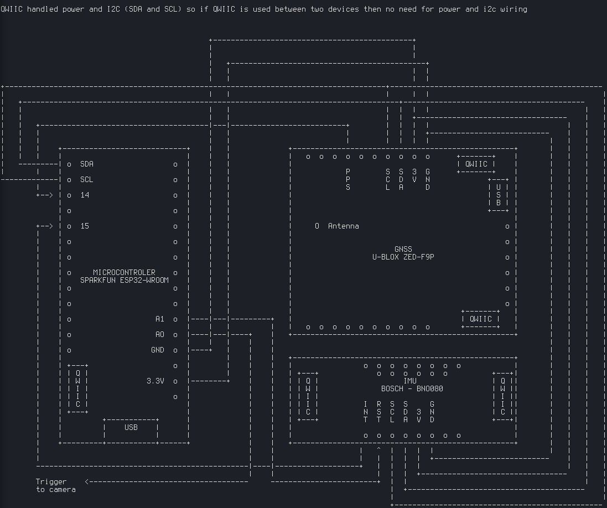

# LoCoPo (LOw COst POsitioning)

A low cost postioning device based on an ESP32 controlling a BNO080 IMU (Inertial Measurement Unit) and a U-Block ZED-F9P GNSS (Global Navigation Satellite Systems)

## Hardware

### IMU: BNO080 (Bosch)
the BNO080 is a The BNO080 is a 9-axis System. it integrates
- a triaxial accelerometer,
- a triaxial gyroscope,
- a magnetometer
- a 32-bit ARM® CortexTM-M0+ microcontroller running Hillcrest’s SH-2 firmware.

The implementation used in the project is: <https://www.sparkfun.com/products/14686>

documentation:
<https://www.hillcrestlabs.com/products/bno085>

### GNSS:  ZED-F9P (u-Blox)
 Multi-band GNSS receiver delivers centimeter level accuracy in seconds
 -   Concurrent reception of GPS, GLONASS, Galileo and BeiDou
 -   Multi‑band RTK with fast convergence times and reliable performance
 -   High update rate for highly dynamic applications
 -   Centimeter accuracy in a small and energy efficient module
 -   Easy integration of RTK for fast time‑to‑market

The implementation used in the project is: <https://www.sparkfun.com/products/15136>

documentation: <https://www.u-blox.com/en/product/zed-f9p-module#tab-documentation-resources>

### Microcontroller: ESP32 (Espressif Systems)
ESP32 is a low-cost, low-power system on a chip (SoC) integrating:
 -  Wi-Fi (2.4 GHz band)
 - Bluetooth 4.2
 - Dual high performance cores
 - Ultra Low Power co-processor
 - Several peripherals

The implementation used in the project is: <https://www.sparkfun.com/products/14689>
Since the communication capabilities are not used therefore STM32 could have been a better choice.

documentation: <https://docs.espressif.com/projects/esp-idf/en/latest/api-reference/index.html>

### Wiring

## Software
The developmenent framework is plain ESP-IDF (C99 code but it should be possible to write C++ code).x
The code is compiled using the ESP-IDF version is the stable v3.3 <https://docs.espressif.com/projects/esp-idf/en/v3.3/>

### Sources
- main.c: initialization and task creation
- imu.c imudef.h imu.h: imu code
- gnss.c gnss.h ubx.c ubx.h nmea.x nmea.h rtcm.c rtcm.h: gnss related code. Note: RTCM is not yet implemented
- sync.c/h: synchronization operations consisting in listening to GNSS PPS signal (marking the begining of  the second), and the interrupts send by the IMU (indicating data availibility)
- trigger.c. trigger.h: manage the camera triggering. To this end, a timer is used which is synchronized with the GNSS PPS
- console.c console.h: command parsing (hit enter in the console to display help)
- common.c common.h: common stuffs like PIN definitions and load/save settings
- myi2c.c myi2c.h: I2C I/O operations
- mynvs.c mynvs.h:  I/O NVS (non volatile storgae) flash memory operations

### Licence
The whole code is licensed under the MIT license

##### IMU
the code is a complete rewriting for ESP32 of the sparkfun arduino library (https://github.com/sparkfun/SparkFun_BNO080_Arduino_Library> which has been released under MIT licence.

##### GNSS
some portions of the code are inspired by the PX4 library ( <https://dev.px4.io/v1.9.0/en/contribute/licenses.html>) which has been released under BSD-3 licence.